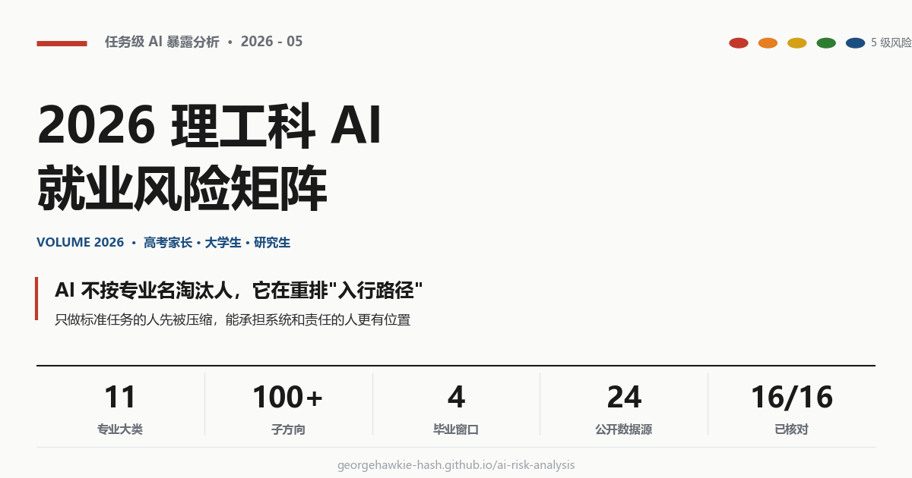
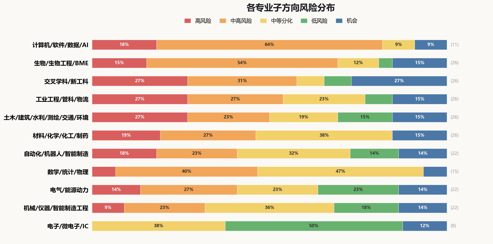

# 2026 理工科 AI 就业风险矩阵

> **AI 不会按专业名淘汰人，它在重排"入行路径"——只做标准任务的人先被压缩，能承担系统和责任的人更有位置。**

为高考家长、大学本科、研究生三类决策者拆解入行路径预警——核心问题不是"AI 会不会替代某专业"，而是"**到我毕业那一年，这个专业的入门岗位还剩什么**"。

### 📖 [在线阅读完整版（含子方向细分 + 家长 FAQ）](https://georgehawkie-hash.github.io/ai-risk-analysis/stem_ai_job_risk_article.html)

**项目规模**：11 个专业大类 · 100+ 子方向细分 · 4 个毕业决策窗口（2027–2031+） · 24 个公开数据源 · 16/16 核心数据已逐项核对

### 📲 转发到微信 / 微博

直接复制网址：`https://georgehawkie-hash.github.io/ai-risk-analysis/stem_ai_job_risk_article.html`

页面已配好 og:image / twitter:card 等社交卡片元数据，链接卡片预览会自动渲染下图（1200×630）：



生成脚本：[`generate_social_card.py`](generate_social_card.py)。如果微信对 GitHub Pages 兼容性不佳，可在浏览器 `Ctrl+P` 转 PDF 后用微信发文件。

---

## 全景速看



> **图表读法**：每行 = 一个专业大类内全部子方向按风险等级的占比。排序依据：综合得分 = 高风险% + 中高风险% × 0.6（0.6 权重仅用于呈现顺序，不构成定量预测）。图右侧的"子方向数 / 综合得分"两列让排序透明可核验。
>
> 生成脚本：[`generate_chart.py`](generate_chart.py)。

### 三句话总结

1. **计算机/AI、生物/生物医学工程、交叉新工科位居入门风险前三。** 共同点：入门岗位以代码、文献、演示项目、标准报告为主——这恰好是 AI 当前加速最快的任务类型。
2. **电子/集成电路、机械/仪器、电气/能源整体偏右。** 原因不是行业好，而是入门岗位里有较多需要硬件、试验、现场调试和签字责任的工作，AI 难独立完成。
3. **没有"安全专业"。** 每个大类内部都至少存在 1 个红色子方向。最终决定的不是专业名，而是**子方向 + 学校平台 + 项目经历**这三个组合。

---

## 30 秒读懂这张矩阵

1. **判断单位是"入门任务"，不是专业名。** 同一专业内部，子方向风险可从"红"到"蓝"全谱分布——这是矩阵设计成 **11 大类 × 4 列 × 100+ 子方向** 的原因。

2. **红色 ≠ 这个专业完蛋。** 红色 = 写常规增删改查代码、做经营报表、画工程图、整理文献综述这类入门任务最先被 AI 加速；蓝色 = 行业需求扩张但低端演示项目仍会同质化。**两个颜色都不直接对应就业结果**。

3. **决策窗口决定看哪一年。** 高考 = 看 2030 入门岗位；考研 = 看 2029；本科转向 = 看 2027–28 实习季；读博 = 看 2031 之后。**2026 年的热度不等于 2030 年的入口宽度**。

4. **"物理 + 签责"是当前最稳的护城河。** 实验台、设备调试、电网继保、临床流程、施工现场——AI 短期内无法独立完成的工作，是入门岗位最慢被压缩的方向。

5. **本工具是参考框架，不是命运预测。** 核心数据是 Anthropic 美国 Claude 使用情况（**16/16 数值已逐项核对原始数据集**），映射大陆 2030 校招属于定性外推。请配合学校就业质量报告和目标行业校招信息使用。

---

## 风险等级图例

| 等级 | 含义 | 例子 |
|---|---|---|
| 🔴 **高** | 入门任务高度数字化，已被 AI 明显压缩 | 常规后端代码、经营报表、工程制图、文献综述、项目周报 |
| 🟠 **中高** | 大量入门任务可被 AI 加速，但仍需落地能力 | 工程仿真、工程造价、质量检测、销量预测、实验记录 |
| 🟡 **中** | 内部分化大，通用任务暴露但系统/现场更稳 | 数字芯片设计、结构计算、临床统计、机械结构设计 |
| 🟢 **低** | 物理/现场/安全/法规约束强，直接替代慢 | 高压试验、施工管理、生物样本库、设备运维、计量校准 |
| 🔵 **机会** | 需求可能扩张，但低端演示项目仍有同质化风险 | 电网/储能、人形机器人、自动化实验室、AI 用于科研、脑机接口 |

> 颜色描述的是**任务被 AI 渗透的程度**，而不是"会失业的概率"。

---

## 决策路径：你处在哪个窗口？

| 你的身份 | 决策年份 | 核心问题 | 怎么用 |
|---|---|---|---|
| 🎓 高考选专业 | 看 2030 入门岗位 | 四年后 AI 能稳定承担多少入门任务？这个专业的"通用入门岗位"届时是否还需要大量新人？ | 看主矩阵第一列。红色专业不是"不能选"，而是"选了要尽早往系统/现场方向走"。 |
| 📚 考研 | 看 2029 毕业 | 读研让你进入更高责任链，还是只在已经商品化的任务上加学历？目标导师的平台是否真实？ | 看主矩阵第二列。**专业名不如平台关键**——看导师有没有设备、数据、产业合作。 |
| 🔁 本科在读转向 | 看 2027–28 实习季 | 实习市场要的是"能用 AI 交付完整项目"的人，不是"会用工具"的人。我的项目能证明系统能力吗？ | 看主矩阵第三列。子方向的"危险入口 vs 更稳能力"是关键判断点。 |
| 🔬 读博/科研 | 看 2031 之后 | 论文复现和文献综述的稀缺度还会跌。研究路径里有没有独占样本、仪器、数据或工程平台？ | 看主矩阵第四列。"机会"标签 = 上限高但波动大；要看具体子方向。 |

---

## 主矩阵：时间场景 × 专业入口

| 大陆专业入口 | 高考选专业（看 2030） | 考研（看 2029） | 本科在读转向（看 2027-2028） | 读博/科研路线（看 2031+） |
|---|---|---|---|---|
| **计算机类/软件工程/数据科学/AI** | 🔴 **高** — 简单业务开发减少。做常规功能、改小 bug、拼接口的机会会减少。 | 🔴 **高** — 业务开发学历溢价降。只读研再写业务代码，竞争力变薄。 | 🔴 **高** — 实习要能交付系统。会用 AI 做完整项目的人更占优。 | 🟠 **中高** — 博士需做平台难题。价值来自系统、数据、评测和研究平台。 |
| **数学类/统计学类/物理学类** | 🟠 **中高** — 推导/报告被自动化。解题、代码和解释文字会被快速增强。 | 🟠 **中高** — 纯模型难换岗位。没有业务或实验数据，模型能力难落地。 | 🟠 **中高** — 转向要接真实数据。实习需落到金融、制造、能源等系统。 | 🟡 **中** — 实验/数据决定上限。有仪器、样本或独占数据更稳。 |
| **电子信息类/微电子/集成电路** | 🟡 **中** — 只写测试脚本会变窄。仿真、测试说明和批量脚本更容易被工具替代。 | 🟡 **中** — 系统/工艺拉开差距。验证、模拟、器件和量产经验更值钱。 | 🟠 **中高** — 仿真文档最易压缩。只会跑脚本和写测试说明，入口变窄。 | 🔵 **机会** — 架构/工艺/工具链有机会。长期机会在系统架构、先进工艺和芯片设计软件。 |
| **电气类/能源动力类** ⚠️ | 🟢 **低** — 用电增长托底。电气化、储能和算力带来长期工程量。 | 🟢 **低** — 现场安全调试更稳。接入电网、保护设备和安全签字不能只靠 AI 完成。 | 🟡 **中** — 计算报告被工具化。潮流、方案比较和报告会交给软件。 | 🔵 **机会** — 电网/储能长期扩张。机会在新型电力系统和电力电子。 |
| **自动化类/机器人工程/智能制造** | 🟠 **中高** — 仿真/看板先压缩。纯演示不够，要接设备、传感器和产线。 | 🟡 **中** — 控制必须过实机。算法要通过稳定性、安全和现场闭环。 | 🟠 **中高** — 别只做演示项目。实习要有设备调试、现场验收或故障复盘。 | 🔵 **机会** — 机器人要进场景。机会在工业、边缘 AI 和真实平台。 |
| **机械类/仪器类/智能制造工程** | 🟡 **中** — 制图/仿真先分化。只会画图和跑报告，入口会变窄。 | 🟡 **中** — 仿真要接试验。工程仿真的价值来自载荷、边界和试验校核。 | 🟡 **中** — 制造测量更保值。加工、装配、计量和质量更有信号。 | 🔵 **机会** — 高端装备有缺口。机会在母机、装备和关键基础件。 |
| **土木/建筑/水利/测绘/交通/环境** | 🟡 **中** — 新建放缓转存量。地产设计收缩，更新、水务和运维更稳。 | 🟡 **中** — 会软件还不够。读研要接触监测数据、工程模型和真实项目。 | 🟠 **中高** — 图纸算量先压缩。施工图、造价、报告少留给新人。 | 🔵 **机会** — 城市生命线上行。机会在灾害、交通、水务和环境平台。 |
| **材料/化学/化工与制药** | 🟠 **中高** — 文献/谱图先压缩。综述、图表和初筛不再稀缺。 | 🟡 **中** — 中试/良率定价值。配方之外要会放大、安全和质量。 | 🟠 **中高** — 记录报告变薄。实验记录、质量检测图表和注册申报文本被工具化。 | 🔵 **机会** — 平台闭环上行。机会在高通量、表征、工艺和材料数据。 |
| **生物科学/生物工程/生物医学工程** | 🟠 **中高** — 组学/演示项目先压缩。公共数据、影像标注和 AI 医疗演示同质化。 | 🟡 **中** — 样本/临床定价值。课题要接样本、仪器、伦理和验证。 | 🟠 **中高** — 记录和报告岗位减少。图像统计、实验报告和常规记录会被工具化。 | 🔵 **机会** — 平台闭环定上限。机会在多组学、器械、药物和实验自动化。 |
| **工业工程/管理科学与工程/物流工程** | 🟠 **中高** — 报表/预测先压缩。经营报表、库存预测和流程文档更少留给新人。 | 🟠 **中高** — 模型要进流程。只会优化算法不够，要落到系统和组织。 | 🟠 **中高** — 低端计划岗变薄。计划、调度、项目管理和外贸单证会被工具化。 | 🔵 **机会** — 复杂供应链上行。机会在工业软件、控制塔和真实网络优化。 |
| **交叉学科/新工科** | 🟠 **中高** — 名词热先分化。没有平台和硬件，交叉专业会变泛。 | 🔵 **机会** — 平台/导师定价值。看设备、数据、临床/产业合作，不看专业名。 | 🔴 **高** — 只做演示项目风险高。只调用模型、做大屏、写方案，难证明真实能力。 | 🔵 **机会** — 前沿赛道高波动。机器人、工业软件、脑机接口、AI 用于科研——上限高但淘汰快。 |

> ⚠️ **电气类备注**：主格"低"评级是被有签责的现场岗（继保/高压/检测）拉低的；22 个子方向里实际有 3 个高风险 + 6 个中高风险，电力数字化/储能/碳管理压力大。**必须展开看子方向细分**。

---

## 公开情报校准

六个公开信号，用于校准哪些入门任务正在变薄，哪些能力仍需要真实系统和责任链。

| 信号 | 对矩阵的含义 |
|---|---|
| **1. 文字、代码、报表最先被 AI 渗透** | Anthropic 与 Microsoft 的职业任务研究都指向同一类任务：写代码、写报告、做数据分析、整理文档最容易被 AI 辅助进入流程，这不等同于岗位替代。 |
| **2. 软件入口正在重排** | 开发者调查和工程效能报告显示，AI 已进入日常开发流程；普通实现、测试和文档的技能溢价下降，系统交付与可靠性更重要。 |
| **3. 现场、硬件、实验仍是分水岭** | 机器人、智能制造、电力、机械、土木和生物医药资料都说明：AI 会提效，但设备、样本、现场验收和签责不能省掉。 |
| **4. 工程类不是天然安全** | 工程制图（CAD）、建筑信息模型（BIM）、工程量清单、仿真报告、检测记录和标准计算会被工具化；低风险来自责任链，不来自专业名本身。 |
| **5. AI for Science 是机会，也更挑平台** | 材料、生物、药物发现和自驱实验室正在升温；但机会在实验闭环、仪器平台、样本和验证，不在自动写论文。 |
| **6. 政策热度不等于入门宽松** | 具身智能、脑机接口、工业软件、低空经济等被政策支持，但当前观察到的常见入口多先落到演示、数据、测试和方案文档。 |

---

## 数据锚点：Anthropic observed exposure

以下数据来自 Anthropic Economic Index 的 `job_exposure.csv`（[原始数据集](https://huggingface.co/datasets/Anthropic/EconomicIndex/blob/main/labor_market_impacts/job_exposure.csv)）。数值越高，表示这类日常任务越常进入 AI 辅助流程——**不是"多少人会失业"**。

| 职业 | Observed Exposure | 暴露程度 |
|---|---:|---|
| 程序员/低层编码 | 0.7451 | 极高 |
| 软件测试/质量保障 | 0.5195 | 极高 |
| 数据科学 | 0.4605 | 高 |
| 运筹分析 | 0.4288 | 高 |
| 数学家 | 0.4241 | 高 |
| 软件开发 | 0.2880 | 高暴露边缘 |
| 物理学家 | 0.2727 | 中等 |
| 化学家 | 0.2614 | 中等 |
| 材料科学家 | 0.1843 | 中等 |
| 计算机硬件工程 | 0.1453 | 中等 |
| 生物医学工程 | 0.1328 | 中等 |
| 机械工程 | 0.0813 | 较低 |
| 电气工程 | 0.0590 | 较低 |
| 工业工程 | 0.0367 | 很低 |
| 土木工程 | 0.0081 | 很低 |

> 0.745 不是"74.5% 岗位会消失"，而是说明程序员这类任务在 AI 使用数据中暴露更高。工程类数值低，也不等于安全；只是硬件、现场、实验和签责需要更专用的工具和组织流程。
>
> **数据精度核对**：全部 16 个数值已与 Anthropic 官方数据集逐项比对，完全一致。

---

## 子方向细分（100+ 子方向）

每个大类有 10-20+ 子方向细分，含**入口风险、典型出口、危险入口、更稳能力、适合人群**判断。

### [📖 在线阅读所有子方向细分 →](https://georgehawkie-hash.github.io/ai-risk-analysis/stem_ai_job_risk_article.html#subfields)

覆盖的子方向包括：

- **计算机**（11 个）：应用后端/全栈、前端/移动端、游戏开发、软件测试、数据分析/BI、数据工程、AI/大模型应用、网络安全、云计算/SRE/DevOps、系统软件/基础软件、算法/ML/AI Infra
- **数学/统计/物理**（15 个）：纯数学、应用数学、运筹优化、数学教师、统计/因果推断、公职数理岗、统计向数据分析/BI、金融数学/量化、精算、生物统计、理论物理、实验物理、半导体/光电物理、量子/前沿材料、物理教师
- **集成电路**（8 个）：数字 IC 设计、数字验证/DFT、模拟/混合信号、射频/毫米波、器件/工艺、封装/测试、芯片设计软件/工具链、嵌入式/芯片系统
- **电气/能源动力**（22 个）：电力系统/继保、高电压试验、发输变配电运维、电气安全检测、轨道交通电气、核电电气、船舶电气、新能源并网/电力市场、电力电子/电机驱动、半导体厂务电气、储能系统/BMS、电气自动化/PLC/SCADA、电力数字化/AI for Grid、能源管理/碳管理、制冷空调/热泵、新能源项目开发、氢能/燃料电池、数据中心电力基础设施、建筑电气/供配电、微电网/分布式能源、电力通信、热能动力
- **自动化/机器人**（22 个）：机器人算法/ROS、数字孪生/低代码、AMR/AGV、自动化测试执行、PLC/HMI/SCADA、机器视觉、工业物联网/预测性维护、无人机/服务机器人、工业机器人示教/离线编程、控制算法/MPC、工业机器人集成、运动控制/伺服、嵌入式控制、工业网络/总线、过程控制/DCS、机电一体化、功能安全/机器安全、设备运维/TPM、传感器/标定校准、半导体/新能源/汽车产线、力控/灵巧手/人形机器人、工业 AI 边缘闭环
- **机械/仪器**（22 个）：工程制图/CAD、CAE 前处理/仿真报告、CNC/CAM 编程、工艺规划/CAPP、机械技术文档/选型、通用结构设计、增材制造、机构/传动设计、模具/夹具、热流体/CFD、汽车/NVH、航空航天机械、材料成形/焊接、生产制造工程、非标设备、试验验证/可靠性、设备运维/故障诊断、计量/精密测量、质量工程/SQE、智能装备/机器人本体、半导体/新能源装备、工业母机/精密传动
- **土木/建筑/水利/测绘/交通/环境**（26 个）：建筑方案/效果图、CAD/BIM/GIS 制图、工程造价/招投标、工程资料/监理、环评报告/排污许可、城乡规划文本、结构计算/施工图、建筑节能/双碳、交通规划/仿真、消防工程、岩土勘察/基坑、环境工程、固废/土壤修复、结构审签/抗震、桥梁/隧道/道路/铁路、市政给排水、水利水电、轨交/机场/港口、施工现场管理、工程测量外业、基础设施检测、环境监测、智慧建造/数字孪生、城市更新/韧性城市、施工机器人/装配式、水文预报/水务调度
- **材料/化学/化工/制药**（26 个）：文献综述/科研写作、实验记录/数据图表、低端计算化学/材料、注册申报/法规、材料表征/谱图、分析化学/质量检测、药物化学、高分子/涂料/胶黏剂、催化/电化学、工艺包/PFD/P&ID、环保/三废/安评、化工生产运行、化工工艺/中试放大、制药工艺/CMC、金属/无机/陶瓷、电池材料/扣电测试、精细化工/电子材料、化学教师/实验教学、食品/化妆品、化工销售/技术服务、EHS/过程安全、药厂 QA/质量体系、半导体材料/电子化学品、电池/储能/氢能、自动化高通量实验、生物制造/绿色化工
- **生物/生物工程/生物医学工程**（26 个）：文献综述/科研写作、公共组学数据分析、医学影像/病理标注、通用 AI 医疗演示、基础实验记录、显微图像/细胞计数、蛋白/抗体/分子对接、临床试验数据整理、IVD/诊断试剂注册、合成生物学元件、神经信号/可穿戴生理数据、生物制药 QC、细胞培养/类器官、动物实验/药效毒理、发酵工程/生物制造、生物材料/组织工程、医疗器械研发、医疗器械注册、临床研究协调/CRC、农业生物技术/育种、生物教师/科普、生物安全/样本库、实验自动化/自驱实验室、单细胞/空间组学、神经工程/脑机接口/康复机器人、AI 药物发现
- **工业工程/管理科学/物流**（26 个）：经营分析/BI、运筹优化/排产、需求预测/库存补货、流程制度/SOP/咨询、采购询比价/RFQ、国际物流/单证、PMO/项目管理、S&OP/产销协同、仓储数据/WMS/库位优化、运输调度/TMS、电商履约/物流客服、质量工程/SPC、成本核算/产能测算、ERP/MES/APS 实施顾问、现场 IE/精益改善、生产计划排程、供应商质量/SQE、仓储运营/班组管理、工业数据/主数据治理、供应链金融/贸易风险、冷链/医药/危化合规、物流安全/EHS、APS 智能排产、数字供应链控制塔、自动化仓/机器人仓、多式联运/低空物流
- **交叉学科/新工科**（26 个）：模型调用/RAG/Agent 演示、AI 产品助理/数字化方案、数字孪生大屏/智慧园区、智能教育/AI 教学产品、政务智能体/AI for Gov、AI Agent 数据标注/评测、智慧城市/视觉感知方案、消费级 AI 产品/陪伴对话、生成式内容/AIGC 创意、广告投放/营销自动化、具身智能/人形机器人本体、工业软件/CAE/EDA、未来机器人/特种机器人、脑机接口/神经工程、AI4Science/科学智能、量子信息/量子工程、新型显示/Micro-LED、低空经济/通航/eVTOL、合成生物学/生物制造、新材料/纳米/能源材料、能源转型/双碳科学与工程、AI Safety/可靠性、空间智能 × 多场景、智能网联汽车/自动驾驶安全、低空交通/空地协同

---

## 家长高频问答

完整 FAQ 在 [在线版的家长 FAQ 区](https://georgehawkie-hash.github.io/ai-risk-analysis/stem_ai_job_risk_article.html#faq)。10 个常见问题包括：

1. 我孩子要不要选计算机/AI 专业？
2. 土木现在还能学吗？听说"夕阳行业"了
3. "具身智能""脑机科学与技术"这些新专业值得报吗？
4. "机会"标签是不是就等于推荐？
5. 我们家是普通家庭，没有资源，应该怎么决策？
6. 电气类怎么主矩阵是"低"但有 3 个"高风险"子方向？
7. 女孩子学理工科会不会更难？
8. 读博还是工作？哪个更受 AI 影响？
9. 这张表多久会过时？
10. 这份分析来源可靠吗？怎么验证？

---

## 方法

借鉴 Anthropic 的 observed exposure 方法：先看职业任务，再看真实 AI 使用，而不是直接问"AI 会不会替代某专业"。

1. **职业任务** — 用 O*NET 拆解职业任务和时间占比
2. **理论能力** — 判断大语言模型（LLM）是否能显著加速任务
3. **真实使用** — 看 AI 产品的真实使用是否已进入这些任务
4. **自动化权重** — 自动完成比辅助完成权重更高
5. **职业暴露度** — 汇总为 observed exposure

### 四个时间窗口的隐式 AI 能力假设

| 决策窗口 | 假设 |
|---|---|
| **高考 → 2030** | 到 2030 年，AI 能稳定承担当下"初级软件工程师 6 个月经验"的常规任务（增删改查、单元测试、文档、数据库查询、报表）；复杂系统、生产事故、安全签责仍需要人。 |
| **考研 → 2029** | 到 2029 年，AI 在文献综述、数据清洗、标准报告写作、论文复现等"研究助理任务"上达到熟练；导师对没有真实数据/设备的硕士论文兴趣下降。 |
| **本科转向 → 2027-28** | 到 2027-2028 年实习季，企业明显区分"AI 会用 vs. 不会用"的新人，并对"AI+某专业领域"的复合能力定价；纯方案/演示/教程类项目的稀缺度下降。 |
| **读博 → 2031+** | 到 2031 年后，AI 能完成多步长任务（METR 时间长度突破 16-32 小时可靠区间），低端科研任务大规模商品化；独占样本/仪器/数据/平台成为博士价值的核心。 |

如果未来 AI 实际进展与上述假设差距很大，对应列的结论也会偏离。

---

## 数据来源

24 个主要来源分四类：

- **A 级 学术/官方**：Anthropic Economic Index、Stanford HAI、Microsoft Research、教育部、工信部、国家能源局、BLS（美国劳工统计局）、WEF（世界经济论坛）、IFR（国际机器人联合会）、IEA（国际能源署）
- **B 级 行业调查**：Stack Overflow Developer Survey、DORA、LeadDev、RICS、AIA、Gartner、BCG
- **C 级 产业项目**：Synopsys DSO.ai、Cadence Cerebrus、NIST 自驱实验室、Isomorphic Labs、Ginkgo Datapoints
- **政策**：国务院"人工智能+"、工信部人形机器人/脑机接口/智能制造、教育部 2026 本科专业目录

完整列表与 URL 见[在线版数据来源区](https://georgehawkie-hash.github.io/ai-risk-analysis/stem_ai_job_risk_article.html#sources)。

---

## ⚠️ 使用边界

- **核心数据来源**：Anthropic Economic Index（Claude 美国使用数据）+ O*NET 美国职业任务库。这是当前业界最严谨的"AI 任务暴露度"数据，但**它直接反映的是美国市场**。映射到大陆校招属于定性外推。
- **风险等级是"方向性判断"，不是定量预测。** "高/中高/中/低/机会" 表达的是相对压缩力度，**不能换算成失业率或薪资降幅**。
- **时间窗口的 AI 能力假设是隐式的。** "2030 年"格基于"届时 AI 能稳定承担当下低端代码/文档任务"这类假设——如果 AI 进展显著放缓或加速，结论会偏离。
- **请结合本地信息使用**：目标高校的就业质量报告、目标行业的校招行情、本地用人单位的反馈，比任何全国性矩阵都更贴近你具体的决策。

---

## 项目结构

```
├── stem_ai_job_risk_article.html   # 完整文章（家长版 · 可直接浏览）
├── stem_ai_job_risk_article.md     # Markdown 源文本
├── risk_overview.png               # 风险全景图
├── social_card.png                 # 社交分享卡片（1200×630）
├── generate_chart.py               # 全景图生成脚本
├── generate_social_card.py         # 社交卡片生成脚本
├── LICENSE                         # 版权声明（中英双语）
├── robots.txt                      # AI 爬虫屏蔽规则
└── data/
    ├── major_risk_database.json              # 结构化风险数据库（11 大类 × 100+ 子方向）
    ├── public_ai_impact_sources.json         # 公开情报来源（24 个，含 URL/分级/任务信号）
    ├── matrix_headline_replacements_proposed.json  # 矩阵标题候选稿
    ├── claude_independent_review.md          # 独立审核记录（数据库 v0.1）
    ├── public_ai_impact_review.md            # 公开情报校准层审核
    ├── claude_matrix_headline_review.md      # 矩阵标题独立审核
    └── claude_*_subfield_review.md           # 11 个大类的子方向审核
```

---

## 版权

© 2026 Yixu Yao. 保留所有权利。

未经许可，禁止全文转载、商业使用、改编发布、批量抓取或用于训练机器学习模型。允许在非商业讨论、教学或评论中引用少量内容，须注明来源。详见 [LICENSE](LICENSE)。
